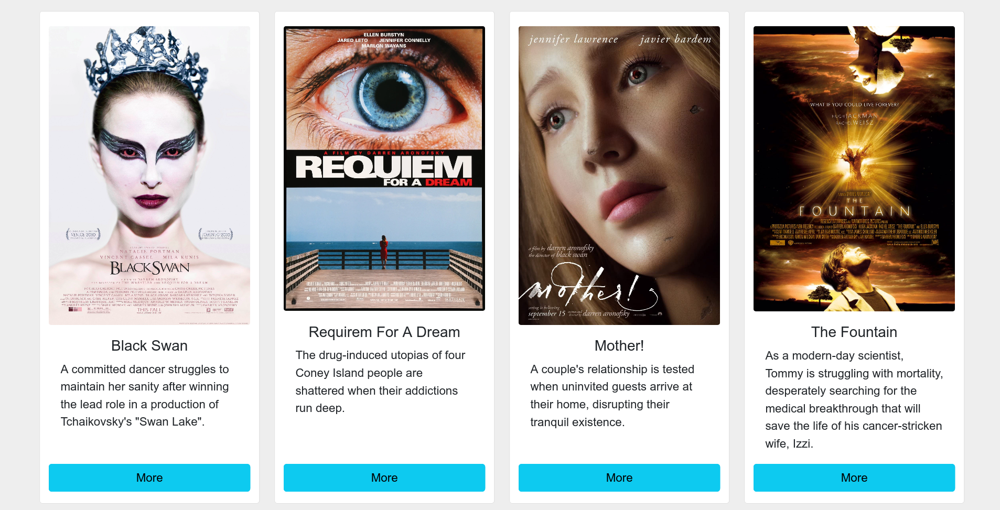

  
# Movies List | صفحة عرض أفلام 

قم ببناء صفحة باستخدام React لعرض مجموعة من الأفلام السينيمائية 

   
    
  
  # المتطلبات
  1. إنشاء مُكون Component
  2. استخدام props 
  3. تنسيق المكونات 
  

   
    
    
  # Screeshot 
  

#

### **اسم المتدرب : عبدالعزيز الاسمري**

### **اسم المشرفة: غادة المطيري**

### **اسم المجموعة: السودة**

